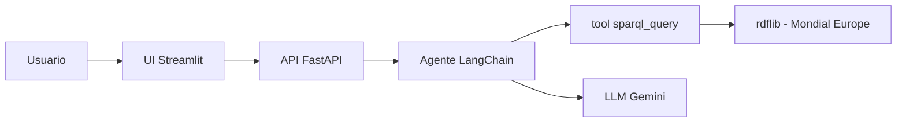

# RAG sobre un Grafo de Conocimiento — Mondial Europe

Sistema RAG (Retrieval-Augmented Generation) donde la **base de referencia es un grafo de conocimiento RDF**, no un corpus de texto. El modelo de lenguaje no responde de memoria: genera una consulta **SPARQL**, la ejecuta contra el grafo y responde **solo** con las filas recuperadas.

## Propósito específico

Asistente geográfico de **Europa**: responde sobre países, capitales, población, superficie, países vecinos, ríos y lagos, usando el dataset [Mondial](http://www.dbis.informatik.uni-goettingen.de/Mondial/) (subconjunto Europa).

## Cómo cumple el enunciado

- **Base de referencia = grafo de conocimiento:** los datos viven en RDF/RDFS (`data/*.rdf`), con una ontología propia (`mondial-meta.rdf`) que define clases y propiedades.
- **Uso de una base semántica:** el retrieval es una consulta **SPARQL** sobre triples tipados (`mon:Country`, `mon:City`, `mon:River`, `mon:capital`, `mon:borders`, ...), no una búsqueda por similitud de texto. Se aprovecha el esquema semántico del grafo.
- **RAG:** patrón *pregunta → recuperación (SPARQL) → generación*. La recuperación se implementa como una **tool** que el agente LangChain invoca antes de responder.

## Arquitectura



Flujo: el usuario pregunta en la UI → la API llama al agente → el agente escribe un `SELECT` SPARQL y lo ejecuta con la tool sobre el grafo en memoria (`rdflib`) → responde en español usando únicamente esas filas.

## Componentes (contenedores)

- `api`: FastAPI + LangChain + Gemini. Carga el grafo y expone `POST /chat`.
- `ui`: chat en Streamlit.

## LLM: Gemini

El agente usa **Gemini** (`gemini-3.6-flash` por defecto). Hace falta `GEMINI_API_KEY` o `GOOGLE_API_KEY`.

Copiá [`.env.example`](.env.example) a `.env` y pegá la key:

```bash
cp .env.example .env
# Editar .env: GEMINI_API_KEY=tu_key
```

También sirve exportarla en la shell: `export GEMINI_API_KEY=tu_key`.

Otro modelo: `MODEL=gemini-3-flash`. `GET /health` responde `llm` y `model`.

## Requisitos

- Docker y Docker Compose.
- Los archivos del grafo ya están en `data/` (ver [Datos](#datos)).
- Una API key de [Google AI Studio](https://aistudio.google.com/apikey).

## Correr con Docker Compose (camino principal)

```bash
docker compose up --build
```

- UI del chat: http://localhost:8501
- API: http://localhost:8000 (`GET /health`, `POST /chat`)

Ejemplos de preguntas:

- "¿Cuál es la capital de Austria?"
- "Nombrame 5 países que limitan con Alemania."
- "¿Qué país europeo tiene mayor población?"
- "¿Cuáles son los ríos más largos?"

## Desarrollo con Dev Container

El Dev Container usa la imagen de Python de `.devcontainer/` (no el `docker-compose.yml` de `api`/`ui`). Las dependencias de `server/` y `ui/` ya vienen instaladas en esa imagen.

Después de `Container started` hay que esperar: Cursor está bajando el server del IDE adentro del contenedor (el aviso de `$BASE_IMAGE` se puede ignorar). El progreso está en Output → **Dev Containers**, no en esa línea.

Si hace falta reconstruir: Command Palette → **Dev Containers: Rebuild Container**.

Definí `GEMINI_API_KEY` en `.env` o en la terminal antes de arrancar la API.

### Correr los servicios a mano dentro del contenedor

Con la key de Gemini, desde una terminal del contenedor:

API (FastAPI):

```bash
uvicorn server.app.main:app --host 0.0.0.0 --port 8000 --reload
```

UI (Streamlit), en otra terminal:

```bash
cd ui
API_URL=http://localhost:8000 streamlit run app.py --server.port 8501 --server.address 0.0.0.0
```

## Debug: ver la consulta SPARQL

En [`server/app/graph.py`](server/app/graph.py), dentro de `sparql_query`, hay una línea comentada:

```python
# DEBUG: descomentar para ver en los logs de la API la consulta SPARQL enviada al grafo.
# print(query, flush=True)
```

Descomentar `print(query, flush=True)` y mirar los logs de la API (`docker compose logs -f api` o la consola de `uvicorn`) para ver el SPARQL que el modelo generó y ejecutó.

## Datos

Subconjunto Europa de Mondial, en `data/`:

- `mondial-europe.rdf` / `mondial-europe.n3`: instancias (países, ciudades, ríos, ...).
- `mondial-meta.rdf` / `mondial-meta.n3`: ontología RDFS/OWL (clases y propiedades).

La aplicación carga los `.rdf` (RDF/XML), que `rdflib` parsea de forma confiable. Los `.n3` se incluyen como versión legible del mismo grafo. Prefijo del vocabulario:

```
PREFIX mon: <http://www.semwebtech.org/mondial/10/meta#>
```

Fuente: MONDIAL, Universidad de Göttingen — http://www.dbis.informatik.uni-goettingen.de/Mondial/